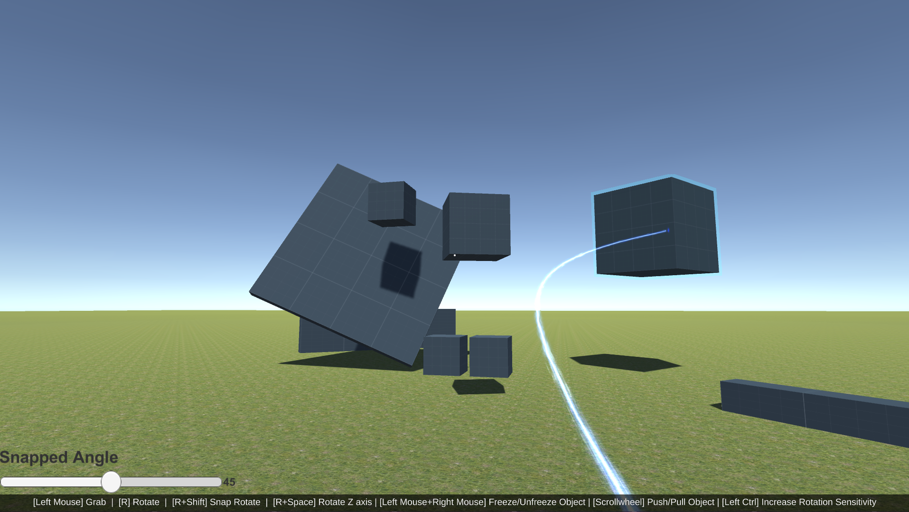

# Unity3d Physics Gun Sample
The goal of this sample is to show an implementation of the "Physics Gun" behavior from Half-Life 2 / Garry's Mod / GMod.

[Video about the creation of this repo, thoughts and reasons behind can be seen here.](https://www.youtube.com/watch?v=ZnWfChctC9M)

# Get started
["PhysicsGunInteractionBehavior.cs"](Unity3d-PhysicsGun/Assets/_PhysicsGunAssets/Scripts/PhysicsGunInteractionBehavior.cs) is the script you are looking for.
This is the script that does most of the actual logic, however, we encourage you to download the entire project and look at the "PhysicsGunSampleScene" as there are more to it than just the behavior. 

Todo: ["If somebody want to write a guide to get started, feel free to do a PR."](https://github.com/Laumania/Unity3d-PhysicsGun/issues/8)
- Needed for outline to work https://github.com/cakeslice/Outline-Effect

Originally the "GravityGun" script in this repo, is based on this script: https://pastebin.com/w1G8m3dH

# Contribute
The point of creating this repo was to have a place where the Unity3d community could collaborate on this "Physics Gun"-script.
So please optimize, add features, fix bugs and send a Pull-Request - I'll be happy to look at it :)
